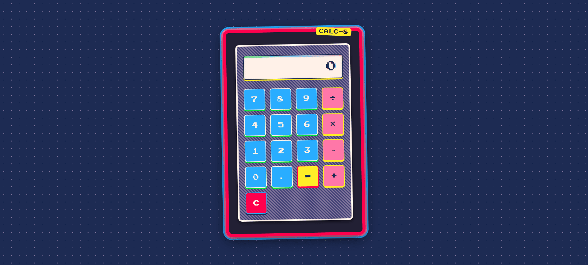

# Calc-8: Calculadora WebAssembly con Go

   

<p align="center">
  
</p>

## 📝 Descripción

Calc-8 es una calculadora web retro que implementa operaciones matemáticas usando WebAssembly compilado desde Go. La aplicación combina una interfaz visual con estilo pixel-art con la potencia y eficiencia de código Go compilado a WebAssembly.

## ✨ Características

- **Operaciones matemáticas básicas**: suma, resta, multiplicación y división
- **Manejo de errores** en operaciones como división por cero
- **Interfaz retro** con estilo pixel-art y animaciones
- **Soporte completo para teclado**
- **Diseño responsivo** para dispositivos móviles
- **Implementación eficiente** usando WebAssembly

## 🚀 Instalación y Ejecución

### Prerrequisitos

- Go 1.16 o superior
- Navegador moderno con soporte para WebAssembly
- Python (opcional, para servir archivos estáticos)

### Compilación y Ejecución

1. Clona el repositorio
   ```bash
   git clone https://github.com/DavidDevGt/calc-8-wasm.git
   cd calc-8-wasm
   ```

2. Compila el codigo Go a WebAssembly
   ```bash
   GOOS=js GOARCH=wasm go build -o web/main.wasm ./cmd/web
   ```

3. Ejecuta el server
   ```bash
   cd web
   python -m http.server 8080
   ```

4. Abre tu navegador en [http://localhost:8080](http://localhost:8080)

## 🔍 Documentación

Para documentación técnica detallada, consulta la carpeta [docs](./docs/):

- [Arquitectura](./docs/arquitectura.md) - Descripción detallada de la arquitectura del sistema
- [API de WebAssembly](./docs/wasm-api.md) - Documentación de la API entre JavaScript y Go/WebAssembly
- [Guía de Desarrollo](./docs/development.md) - Guía para desarrolladores que quieran contribuir al proyecto

## 🧰 Tecnologías Utilizadas

- **Frontend**: HTML5, CSS3, JavaScript (ES6)
- **Backend**: Go 1.16+ compilado a WebAssembly
- **Integración**: wasm_exec.js proporcionado por Go

## 📊 Estructura del Proyecto

```
└── wasm-test/
    ├── cmd/
    │   └── web/             # Código Go para WebAssembly
    │       └── main.go
    ├── docs/                # Documentación detallada
    │   ├── arquitectura.md
    │   ├── wasm-api.md
    │   ├── development.md
    │   └── images/
    │       └── calculator-preview.png
    ├── web/                 # Frontend
    │   ├── index.html       # Estructura HTML
    │   ├── styles.css       # Estilos CSS
    │   ├── main.js          # Lógica JavaScript
    │   ├── wasm_exec.js     # Runtime para WebAssembly
    │   └── main.wasm        # Binario compilado WebAssembly
    ├── go.mod               # Dependencias Go
    └── README.md            # Este archivo
```

## 🤝 Contribuciones

Las contribuciones son bienvenidas. Por favor, sigue estos pasos:

1. Haz fork del repositorio
2. Crea una rama para tu feature (`git checkout -b feature/nueva-funcionalidad`)
3. Haz commit de tus cambios (`git commit -m 'Añadir nueva funcionalidad'`)
4. Haz push a la rama (`git push origin feature/nueva-funcionalidad`)
5. Abre un Pull Request

<p align="center">
  Hecho con mucho ☕
</p>
