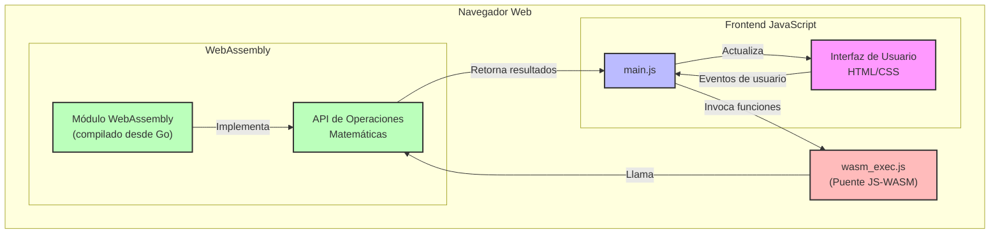

# Arquitectura de Calc-8

Este documento describe la arquitectura técnica de la calculadora Calc-8, que utiliza WebAssembly compilado desde Go para realizar operaciones matemáticas.

## Diagrama de Arquitectura



## Componentes Principales

La aplicación está dividida en tres componentes principales:

### 1. Frontend Web (HTML/CSS/JavaScript)

El frontend está compuesto por:

- **HTML**: Define la estructura de la calculadora y sus elementos interactivos.
- **CSS**: Proporciona el estilo visual con temática retro-pixel.
- **JavaScript**: Maneja la interacción del usuario, la lógica de la calculadora y se comunica con WebAssembly.

**Archivos clave**:
- `index.html`: Estructura de la calculadora
- `styles.css`: Estilos visuales 
- `main.js`: Lógica de la interfaz y comunicación con WebAssembly

### 2. WebAssembly (Compilado desde Go)

El núcleo matemático está escrito en Go y compilado a WebAssembly, proporcionando:

- Funciones aritméticas optimizadas
- Manejo de casos especiales (como división por cero)
- API para ser consumida desde JavaScript

**Archivos clave**:
- `main.go`: Código fuente Go con las operaciones matemáticas
- `main.wasm`: Binario WebAssembly generado

### 3. Biblioteca de Integración (wasm_exec.js)

Este componente es generado por el compilador Go y proporciona la integración necesaria entre JavaScript y WebAssembly.

## Flujo de Datos

1. **Entrada del Usuario**:
   - El usuario interactúa con la interfaz (presionando botones o usando el teclado)
   - Los eventos son capturados por los event listeners en JavaScript

2. **Procesamiento en JavaScript**:
   - Se actualiza el estado de la calculadora (números ingresados, operador seleccionado)
   - Se actualiza la visualización según la entrada del usuario

3. **Cálculo con WebAssembly**:
   - Al solicitar una operación, JavaScript invoca funciones exportadas desde Go
   - Los operandos se pasan al código WASM
   - La operación se realiza en WebAssembly

4. **Visualización del Resultado**:
   - El resultado se devuelve a JavaScript
   - Se actualiza el display de la calculadora con el resultado

## Diseño Responsivo

La interfaz implementa un diseño responsivo mediante:

- Unidades CSS relativas
- Media queries para adaptar la interfaz en dispositivos móviles
- Manejo de eventos táctiles y de ratón

## Consideraciones de Rendimiento

- **Carga Perezosa**: El módulo WebAssembly se carga de manera asíncrona
- **Manejo de Estado Eficiente**: Minimiza las actualizaciones del DOM
- **Animaciones Optimizadas**: Usa transformaciones CSS para mejor rendimiento

## Interacción entre JavaScript y WebAssembly

La interacción entre JavaScript y WebAssembly sigue un patrón bien definido:

```
JavaScript → Go/WebAssembly
  │
  ├─ goAdd(a, b) → Función add() en Go
  │
  ├─ goSub(a, b) → Función sub() en Go
  │
  ├─ goMul(a, b) → Función mul() en Go
  │
  └─ goDiv(a, b) → Función div() en Go
```

## Evolución Futura

La arquitectura permite las siguientes expansiones:

1. Adición de funciones científicas
2. Integración con historial de cálculos
3. Soporte para múltiples temas visuales
4. Implementación de cálculos de alta precisión
