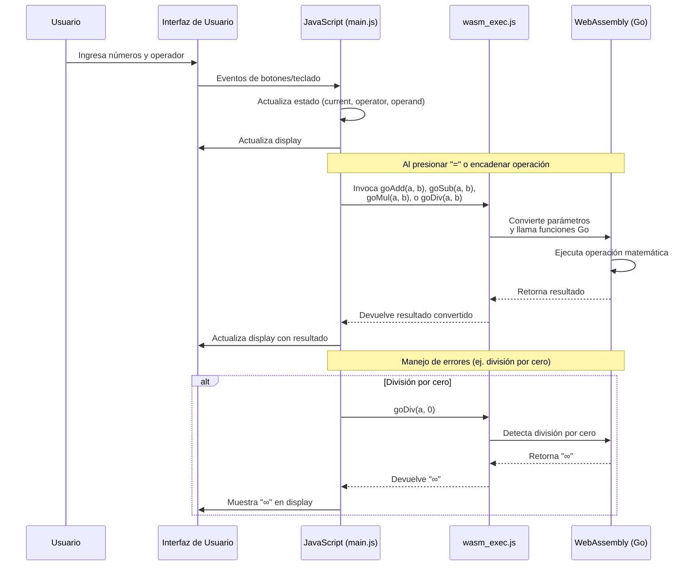

# API de WebAssembly en Calc-8

Este documento describe la API de integración entre JavaScript y WebAssembly en la calculadora Calc-8, detallando cómo las funciones de Go son exportadas y utilizadas desde JavaScript.

## Visión General

La comunicación entre JavaScript y WebAssembly se realiza a través de funciones exportadas por Go y registradas en el objeto global de JavaScript. Estas funciones permiten ejecutar operaciones matemáticas implementadas en Go desde la interfaz de usuario JavaScript.



## Inicialización

Antes de que las funciones de WebAssembly estén disponibles, es necesario inicializar el entorno de ejecución.

```javascript
// Importación del runtime de Go WebAssembly
import './wasm_exec.js';

// Inicialización del entorno Go
const go = new Go();
let wasmReady = false;
let wasmInstance = null;

// Carga asíncrona del módulo WebAssembly
async function loadWasm() {
  const result = await WebAssembly.instantiateStreaming(
    fetch('main.wasm'), 
    go.importObject
  );
  wasmInstance = result.instance;
  go.run(wasmInstance);
  wasmReady = true;
}

// Inicia la carga
loadWasm();
```

## Funciones Exportadas

Las siguientes funciones son implementadas en Go y exportadas a JavaScript:

### `goAdd(a, b)`

Realiza la suma de dos números.

**Parámetros**:
- `a` (Number): Primer operando
- `b` (Number): Segundo operando

**Retorna**: 
- (Number): Resultado de la suma `a + b`

**Implementación en Go**:
```go
func add(this js.Value, args []js.Value) interface{} {
  if len(args) < 2 {
    return 0
  }
  a := args[0].Float()
  b := args[1].Float()
  return a + b
}
```

### `goSub(a, b)`

Realiza la resta de dos números.

**Parámetros**:
- `a` (Number): Minuendo
- `b` (Number): Sustraendo

**Retorna**: 
- (Number): Resultado de la resta `a - b`

**Implementación en Go**:
```go
func sub(this js.Value, args []js.Value) interface{} {
  if len(args) < 2 {
    return 0
  }
  a := args[0].Float()
  b := args[1].Float()
  return a - b
}
```

### `goMul(a, b)`

Realiza la multiplicación de dos números.

**Parámetros**:
- `a` (Number): Primer factor
- `b` (Number): Segundo factor

**Retorna**: 
- (Number): Resultado de la multiplicación `a * b`

**Implementación en Go**:
```go
func mul(this js.Value, args []js.Value) interface{} {
  if len(args) < 2 {
    return 0
  }
  a := args[0].Float()
  b := args[1].Float()
  return a * b
}
```

### `goDiv(a, b)`

Realiza la división de dos números.

**Parámetros**:
- `a` (Number): Dividendo
- `b` (Number): Divisor

**Retorna**: 
- (Number|String): Resultado de la división `a / b`, o "∞" si `b` es cero

**Implementación en Go**:
```go
func div(this js.Value, args []js.Value) interface{} {
  if len(args) < 2 {
    return "NaN"
  }
  a := args[0].Float()
  b := args[1].Float()
  if b == 0 {
    return "∞"
  }
  return a / b
}
```

## Registro de Funciones

Las funciones de Go se registran en el contexto global de JavaScript mediante el siguiente código:

```go
func registerCallbacks() {
  js.Global().Set("goAdd", js.FuncOf(add))
  js.Global().Set("goSub", js.FuncOf(sub))
  js.Global().Set("goMul", js.FuncOf(mul))
  js.Global().Set("goDiv", js.FuncOf(div))
}
```

## Uso desde JavaScript

Ejemplo de cómo estas funciones son invocadas desde JavaScript:

```javascript
// Verificar que WebAssembly esté listo
if (wasmReady) {
  const a = 5;
  const b = 3;
  
  // Suma: 5 + 3 = 8
  const suma = globalThis.goAdd(a, b);
  
  // Resta: 5 - 3 = 2
  const resta = globalThis.goSub(a, b);
  
  // Multiplicación: 5 * 3 = 15
  const multiplicacion = globalThis.goMul(a, b);
  
  // División: 5 / 3 ≈ 1.6666...
  const division = globalThis.goDiv(a, b);
  
  // División por cero: 5 / 0 = ∞
  const divisionPorCero = globalThis.goDiv(a, 0);
}
```

## Consideraciones

1. **Manejo de Errores**: Todas las funciones incluyen validación para prevenir fallos cuando los argumentos son insuficientes.

2. **Conversión de Tipos**: Se realiza automáticamente entre JavaScript y Go.

3. **Rendimiento**: Las operaciones en WebAssembly son más eficientes que las equivalentes en JavaScript puro.

4. **Estado de Carga**: Es importante verificar `wasmReady` antes de invocar funciones, ya que la carga es asíncrona.

## Extensión de la API

Para añadir nuevas funciones matemáticas a la API:

1. Implementar la función en Go siguiendo el patrón establecido:
   ```go
   func nuevaFuncion(this js.Value, args []js.Value) interface{} {
     // Implementación
   }
   ```

2. Registrar la función en el contexto global:
   ```go
   js.Global().Set("goNuevaFuncion", js.FuncOf(nuevaFuncion))
   ```

3. Invocar desde JavaScript:
   ```javascript
   const resultado = globalThis.goNuevaFuncion(/* argumentos */);
   ```
